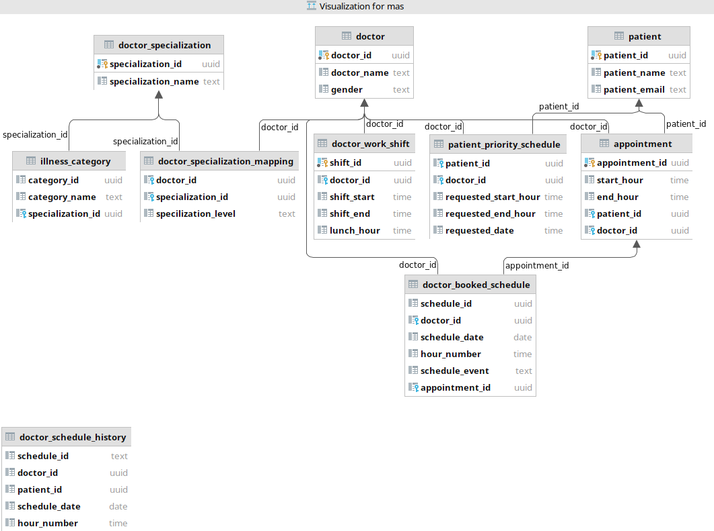

# Final Project Report

## Requirements

### Functional Requirements

| ID     | Description                                                                                                                                                                                     |
| ------ | ----------------------------------------------------------------------------------------------------------------------------------------------------------------------------------------------- |
| FREQ-1 | The system shall allow a patient to make an appointment for their illness.                                                                                                                      |
| FREQ-2 | The system shall assign the patient's illness to a specific illness category.                                                                                                                   |
| FREQ-3 | The system shall display the availability of the doctors whose medical specialization matches the illness category.                                                                             |
| FREQ-4 | In the case no doctor with matching medical specializations is available within 14 days, the system shall display the availability of doctors who most closely match the needed specialization. |
| FREQ-5 | The system shall allow multiple patients to schedule an appointment simultaneously.                                                                                                             |
| FREQ-6 | The system shall minimize waiting times for more severe illnesses.                                                                                                                              |

### Non-functional Requirements

| ID      | Description                                                                      |
| ------- | -------------------------------------------------------------------------------- |
| NFREQ-1 | The system shall ensure every patient is seen within 14 days.                    |
| NFREQ-2 | The system's availability should be greater than .999.                           |
| NFREQ-3 | The storage of the patient's health information must conform to HIPAA standards. |

## Diagrams

### Sequence Diagram

The key interaction of our system was modeled through this sequence diagram. The patient first enters their illness to the appointment booker. After which, it will match that to an illness category which is then matched to a doctor specialization in the mapper. With that information, the schedules of the doctors that match that specialization are viewed through the scheduler object. Once displayed, the patient has the opportunity to book a specific slot, and the scheduler will confirm that the appointment was booked.

### Activity Diagram

The activity diagram describes the chain of processing involved begining when a patient/ doctor/ system administrator logs in teh system. The processing steps shown above for respective user indicate thier respective flow of activities and the data flow between these activities. The activity diagram displays a high level understanding of the data processing and flow. 

### Class Diagram

The class diagram above outlines the object oriented model of our application. The diagram shows the data entities, thier associated attributes and relations amongst these entities.

## Architecture

We chose a layered architecture for developing the application. The top layer supports the users' interface and bottom layer supports the system database. The user communication layer handles the user authentication and input/ output activities from teh user interface. The information retrieval layer includes the scheduling logic, and logic for accessing and updating the system database.

## Specification and Implementation

### Specification

Discussion of specification is largely encapsulataed in the design and implementation component.

The above diagram is a pictorial representation of how we are calculating available slots.

1. The total slots are generated from a work shift. This shift is generated by a registered 
 specified range of hours. We generate hours from that range
2. Next step is to remove all the hours which are not available for several differen reasons.
   1. Lunch Hour - The defined fixed hour 
   2. Booked Schedule Hours - The hours which are already booked in some other appointment
   3. Reserved Slots for priority booking - The slots which are available for booking for prior patients. 
      They are free for booking once 7 days passes.
   4. Available slots joined with Doctor_info, specialization, illness mapping - This part filters the doctor for specialization and illness category which are arguments 
    passed from the app. 

### ER Diagram 
The ER diagram shows all tables and relations for all DB objects in the database.
There's a also a unconnected history table which stores all the past schedule of a doctor and is populated 
at the end of the day.

### Implementation

For this system, the Flask framework written in Python will be used to create the "backend" services of the system. REST APIs and endpoints will be created for the critical functionality of the system such as finding the available schedules and booking a schedule slot. These will be created in accordance with the design created in [specification.md](./specification.md).

Having a data model and a permanent method to store data was also identified as necessary. For this, a PostgreSQL relational database will be created with the data objects identified in the specification. This will be needed in order to permanently store what slots are available and what slots have been booked, and keeping track of other related data.

Two main RESTful API endpoints were created, /schedule and /book. The first core functionality, /schedule, is a GET request which receives the available slot schedules for a patient to view based on the illness category entered. The second core functionality, /book, is a POST request which allows the patient to request to book a specific open schedule slot.

## Dependability Principles

Dependable attributes are the qualities of a system and has the ability to provide services that can be trusted. Medical appointment system is a critical system and should be available 24 x 7 to the user, while designing this system our aim was to provide efficient appropriate doctor according to the patient's  illness. Dependable attributes that we took into consideration are as follows:

* **Availability:** When discussing the dependable attribute the first attribute that was taken into consideration by our team was "Availability" i.e. the system is available (Does not crash) even though there is increase in the load of users on the system, we have achieved this by making system more scalable, we have used container based deployment model that ensures that system handles the load of increased user.
* **Reliability:** Next attribute that was taken into consideration was "Reliability", we have ensured that our suystem is reliable by stress testing our syste  in different scenarios. Along with that we also did input validation of our system (i.e. Tested our system for by providing different inputs and checking the systems response)
* **Security:** The security of patient's information is one of the primary requirements as per FIPA standards. While the security is currently limited to authorization and authentication, firewalls built in the systems and endpoint protection measures, we plan to further protect patients' data by encrypting the user information.

## Project Management

While designing any system, project management is required and our team followed the following project management activities:

1. **Project planning:** We started our project by first studying the problem statement thoroughly and identifying the requirements in the problem statement. We decided to deliver the designed system in three iterations and each in each iteration we ensured new functionality was added. The progress of each individual was tracked by weekly team meetings.
2. **People management:** The project was divided into different sections and each individual was assigned the task based on his/her knowledge on the subject. We ensured that each team members are on the same page by sharing the knowledge with each other. This ensured that there was timely progress and the system was delivered on time.
3. **Risk management:** The following critical risks were indentified for this project.

Risk | Description | Impact | Probability | Severity | Mitigation Strategy
--- | --- | --- | --- |--- |---
Requirements change | More changes to the requirements than planned for. | Project delivery timeline is slowed. | Low: requirements are agreed upon and specified early. | Serious | Specify and agree upon requirements at beginning of project to avoid delays later.
Size underestimate | Project size is underestimaed. | More time is needed for completion. | Moderate: size is usually agreed upon early. | Tolerable | Perform project planning to set a defined schedule and recalculate size throughout development.
Group member loss | A critical group member becomes unavailable. | Project delivery timeline is slowed | High: people have various schedules and are often unpredictable | Catastrophic | Incorporate a plan and hold team members accountable. Hold frequent meetings to keep participants engaged and monitor the progress of assignments.
4. **Proposal writing:** After receiving the problem statement the first thing we did was to write a proposal, in this we stated our objective and how do we plan to work on the project. It also included what softwares and programming languages we will be using , since this was just a team project for the subject we did not calculate cost and delivery estimates.

### Gantt Chart

We used the Gantt chart to track the overall progress of our project. This helped in organizing our sprints and track our missed targets during sprints and iterations. Placed below is the Gantt chart used by the team.

## Advance SWE - Reuse

One of the primary objectives in designing this application was to focus on the reuse of existing, off-the-shelf tools for both the ease of building this calendar application, as well as simplifying the modifications to this application in future calendar work for different scheduling tasks.

The entire front-end component of the system was designed using FullCalendar, a partially open-source development tool for all calendar styles. It supports all basic scheduling and booking functionalities. The open source version contains all necessary components for our application, as we primarily rely on blocking off available times and displaying those times to the user. More advanced fetures, available in the paying version of FullCalendar, are largely useless for our scheduling applications, as they involve more complex GSuite-type tasks like drag and drop features, as well as cross-device synchroniation and others.

Additionally, our application is a perfect candidate for reuse in other scheduling tasks for medical systems which do not have our exact specifications. Any additional parameters that must be saved within the appointment object are strictly defined in the FullCalendar API and can be modified in only 2 places in the entire application that will render them available everywhere. 

For instance, if the system was to be repurposed for an appointment scheduler with a parameter that accounted for appointment room, that could be easily placed in the front end via FullCalendar. 

*The report should describe and support your design, specification and implementation choices, outlining how you integrated principles of dependability, project management and advanced software engineering into your project. Finally, the report should contain a description of your testing and evaluation processes.*

## Testing and Evaluation

Our testing was made up of three key phases:

### Unit tests

Each individual object class shall be tested separately by evaluating each method in the class by at least 3 separate values/conditions that lie in different equivalence partitions. Each class attribute should be retrieved and attempt to be set, to ensure proper visibility of class components are realized, and placing the class in all possible states.
In a feature iteration, these tests will be elaborated upon and could even be tested using an automation framework for unit testing.

#### Test ideas

* Input validation
  * Illness category that doesn't match a known illness
  * Invalid patient id
  * Unavailable time slot requested for booking
  * Date in the past requested for booking
  * Unknown doctor requested for booking

### Component tests

Upon successful unit testing, component testing shall follow. This will include the interfaces that must interact between the various classes. Here we shall stress test the timing of one component interfacing with another, quickly repeating calls to another component, and testing parameters at the edges of parameter limits.

#### Test ideas

1. Overloading the interfaces of the APIs for getting a service, or booking a time slot, with quick, back-to-back requests, and observing how the components respond.
   * A testing tool, Locust, has been identified which allows for load testing by creating repeated calls to a service and tracking the system's response

### System tests

Upon successful completion of component testing, system testing shall proceed. Here we shall ensure that the system has integrated properly by evaluating the enumerated and developed use cases and ensure that the output matches what is expected.

#### Test Ideas

1. Testing that a patient can receive an accurate schedule for any type of illness and then succesfully book it
2. Testing cases where the 14 day limit is potentially not abided by and ensuring the system properly conforms to that important constraint
3. Security testing (pen testing, encryption protocols for medical privacy, etc.)

Our evaluation and testing also relied on utilizing the sample data we generated and executing our system with that data. Essentially, the key uses cases of the system were performed to ensure that the system conformed to specification and that we were confident in our system.
