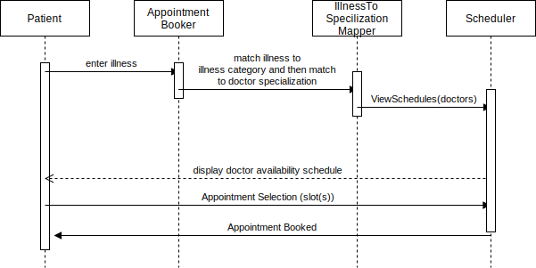

# Final Project Report

## Requirements

### Functional Requirements

| ID     | Description                                                                                                                                                                                     |
| ------ | ----------------------------------------------------------------------------------------------------------------------------------------------------------------------------------------------- |
| FREQ-1 | The system shall allow a patient to make an appointment for their illness.                                                                                                                      |
| FREQ-2 | The system shall assign the patient's illness to a specific illness category.                                                                                                                   |
| FREQ-3 | The system shall display the availability of the doctors whose medical specialization matches the illness category.                                                                             |
| FREQ-4 | In the case no doctor with matching medical specializations is available within 14 days, the system shall display the availability of doctors who most closely match the needed specialization. |
| FREQ-5 | The system shall allow multiple patients to schedule an appointment simultaneously.                                                                                                             |
| FREQ-6 | The system shall minimize waiting times for more severe illnesses.                                                                                                                              |

### Non-functional Requirements

| ID      | Description                                                                      |
| ------- | -------------------------------------------------------------------------------- |
| NFREQ-1 | The system shall ensure every patient is seen within 14 days.                    |
| NFREQ-2 | The system's availability should be greater than .999.                           |
| NFREQ-3 | The storage of the patient's health information must conform to HIPAA standards. |

## Diagrams

### Sequence Diagram

The key interaction of our system was modeled through this sequence diagram. The patient first enters their illness to the appointment booker. After which, it will match that to an illness category which is then matched to a doctor specialization in the mapper. With that information, the schedules of the doctors that match that specialization are viewed through the scheduler object. Once displayed, the patient has the opportunity to book a specific slot, and the scheduler will confirm that the appointment was booked.

### Activity Diagram

The activity diagram describes the chain of processing involved begining when a patient/ doctor/ system administrator logs in teh system. The processing steps shown above for respective user indicate thier respective flow of activities and the data flow between these activities. The activity diagram displays a high level understanding of the data processing and flow. 

### Class Diagram

The class diagram above outlines the object oriented model of our application. The diagram shows the data entities, thier associated attributes and relations amongst these entities.

## Architecture

We chose a layered architecture for developing the application. The top layer supports the users' interface and bottom layer supports the system database. The user communication layer handles the user authentication and input/ output activities from teh user interface. The information retrieval layer includes the scheduling logic, and logic for accessing and updating the system database.

## Specification and Implementation

### Specification

### Implementation

For this system, the Flask framework written in Python will be used to create the "backend" services of the system. REST APIs and endpoints will be created for the critical functionality of the system such as finding the available schedules and booking a schedule slot. These will be created in accordance with the design created in [specification.md](./specification.md).

Having a data model and a permanent method to store data was also identified as necessary. For this, a PostgreSQL relational database will be created with the data objects identified in the specification. This will be needed in order to permanently store what slots are available and what slots have been booked, and keeping track of other related data.

Two main RESTful API endpoints were created, /schedule and /book. The first core functionality, /schedule, is a GET request which receives the available slot schedules for a patient to view based on the illness category entered. The second core functionality, /book, is a POST request which allows the patient to request to book a specific open schedule slot.

## Dependability Principles

## Project Management

## Advance SWE - Reuse

## Testing and Evaluation

Our testing was made up of three key phases:

### Unit tests

Each individual object class shall be tested separately by evaluating each method in the class by at least 3 separate values/conditions that lie in different equivalence partitions. Each class attribute should be retrieved and attempt to be set, to ensure proper visibility of class components are realized, and placing the class in all possible states.
In a feature iteration, these tests will be elaborated upon and could even be tested using an automation framework for unit testing.

#### Test ideas

* Input validation
  * Illness category that doesn't match a known illness
  * Invalid patient id
  * Unavailable time slot requested for booking
  * Date in the past requested for booking
  * Unknown doctor requested for booking

### Component tests

Upon successful unit testing, component testing shall follow. This will include the interfaces that must interact between the various classes. Here we shall stress test the timing of one component interfacing with another, quickly repeating calls to another component, and testing parameters at the edges of parameter limits.

#### Test ideas

1. Overloading the interfaces of the APIs for getting a service, or booking a time slot, with quick, back-to-back requests, and observing how the components respond.
   * A testing tool, Locust, has been identified which allows for load testing by creating repeated calls to a service and tracking the system's response

### System tests

Upon successful completion of component testing, system testing shall proceed. Here we shall ensure that the system has integrated properly by evaluating the enumerated and developed use cases and ensure that the output matches what is expected.

#### Test Ideas

1. Testing that a patient can receive an accurate schedule for any type of illness and then succesfully book it
2. Testing cases where the 14 day limit is potentially not abided by and ensuring the system properly conforms to that important constraint
3. Security testing (pen testing, encryption protocols for medical privacy, etc.)

Our evaluation and testing also relied on utilizing the sample data we generated and executing our system with that data. Essentially, the key uses cases of the system were performed to ensure that the system conformed to specification and that we were confident in our system.

*The report should describe and support your design, specification and implementation choices, outlining how you integrated principles of dependability, project management and advanced software engineering into your project. Finally, the report should contain a description of your testing and evaluation processes.*
